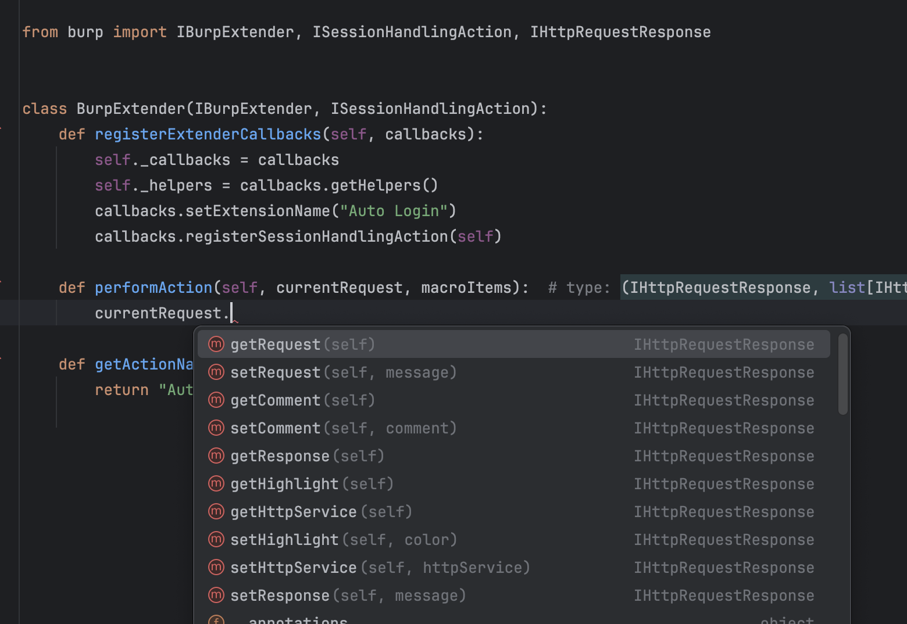

Burp interfaces with typing hints for python/jython Burp extension development with intellisense support. Works best with PyCharm.

# Setup

```
git clone https://github.com/hakatemia/burp
cd burp
pip install setuptools
python setup.py install
```

# Usage

Now in your extension, as long as you use the same python interpreter where you installed the package, you should get intellisense support.



# Credits

Based on work from https://github.com/elnerd/burp-interfaces
